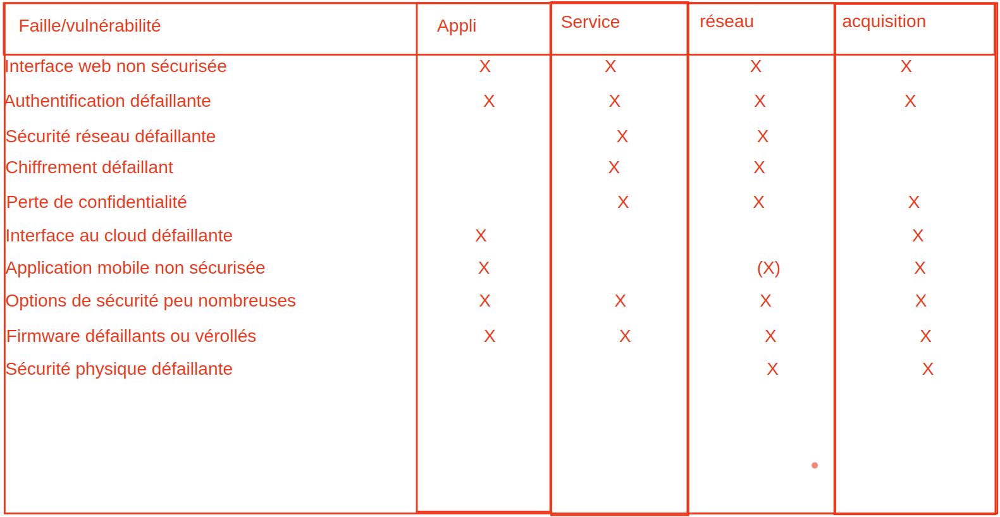
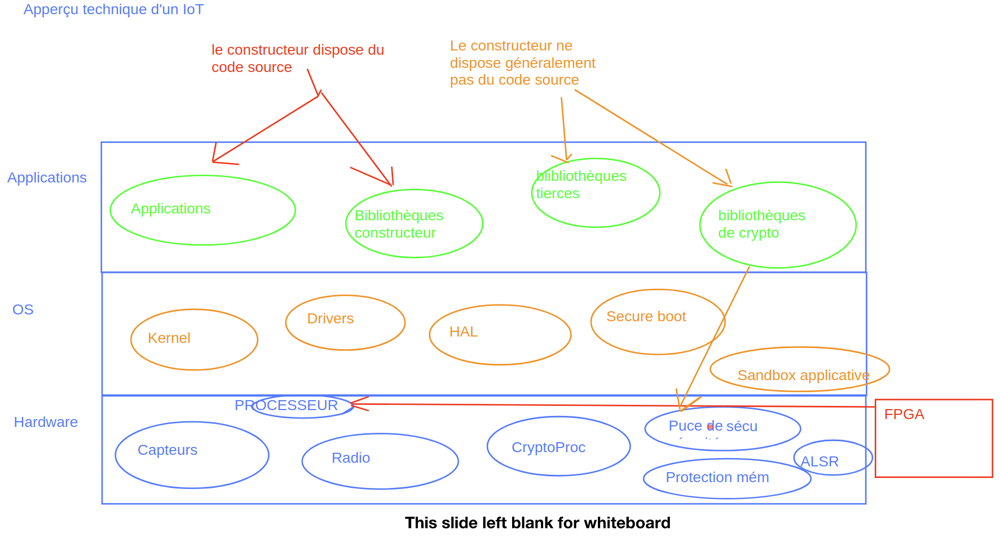

# IOT

On trouve de plus en plus d'bjet IOT qui remonte des infos dans le cloud (camera, badgeuse, capteurs, etc)

## Conception

4 couches : 

### 1 - acquisition : 
* Capteurs de toutes sortes => collecte des informations. 
* Peu de puissance de calcul (pas de grosses puces).
* __=>__ comment intégrer la sécurité à ce niveau ? 

### 2 - Réseau : 
* Permet de connecter lesobjets à l'internet. 
* Beaucoup de vulnérabilités (evesdropping : ecoute/interception), deni de service, usurpation des noeuds.
* A toute les  vuln d'un réseau classique sans les sécurités qui vont avec

### 3- Services : 
* Fournir l'essentiel des services aux applications embarquées dans l'objet ou a ses utilisateurs (pache / dns / ssh / biblio interne pour traiter les informations)

#### 4 - Application :
* Sert aux utilisateurs pour paramétrer l'objet, ou intéragir avec lui.

## Aperçu technique d'un IOT

* FPGA : puce sans rien, au constructeur de programmer la puce. Source de faille mais permet de patcher

Puces de sécurité : processeur crypto + puce de sécurité
Objectif : fournir les éléments de cryptographie nécessaire à la protection des firmwares et des communication, les algos de crypto sont implémentés physiquement dans les puces de sécurité et exécutés par un processeur dédié aux calculs crypto (décharge le microprocesseur central de ces traitements).

## Failles techniques/physiques

* Failles dues au materiel : beaucoup de type de failles possibles
* Blindage absent (sensibilité aux rayonnements électromagnetiques)
* JTAG/GPIO (debug)
* Interface "série" pour reset l'équipement
* Bouton reset usine
* Firmware : OS+logiciels présents sur une mémoire de stockage et chargés au démarrage => quel type de contrôle met-on en oeuvre pour 

