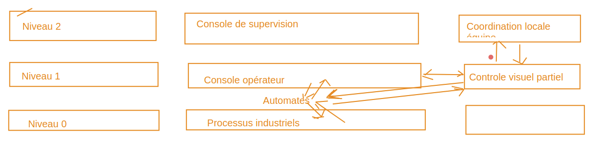

# Securité des réseaux industriels

## ICPE - installations classés pour la protection de l'environnement

__"usines, ateliers, dépôts, chantiers, installations exploitées ou détenues par toute personne physique ou morale, publique ou privée, pouvant présenter des dangers ou des inconvénients pour le voisinage, pour la santé, la sécurité, la salubrité, l'agriculture, la nature, la conservation des sites et monuments et les éléments du patrimoine archéologique".__

## Installation industrielle 

__Système technologique délimité par un périmètre (ex : un site) qui peut être__

* Un site fixe (un lieu de stockage, un lieu d'approvisionnement, une usine, une raffinerie, un réseau de transports, un port maritime...)
* Un site mobile (pétrolier, croiseur, plateforme pétrolière, satellite...)__

__La configuration du site peut-être de deux formes :__

* Monolithique : un endroit unique (site) ou tout est centralisé.
* Réseau hybride : champ éolien, smartgrid (genre linky)

## Travaux du passé sur la sécurité des réseaux infustriels et installations industrielles

### Modèle purdue : 

* __Début de l'ère industrielle -> concentration des efforts d'ingéniérie sur des méthodes permettant d'optimiser les processus de fabrication (redondance équipements -> pb de porte-monnaie, ne pas perdre d'argent à cause d'une prod défaillante -> resillience industrielle). Optimisation des méthodes de stockage des matières premières ou produits finis (flux tendu)__

* __Début 1900 => premières normes environnementales : premier crash pétrolier =>  nécésité de réfléchir à modifier l'approche purement optimisation économique dans la conception des usines (installation industrielles) -> arrivée de l'informatique

Début des travaux : 1970, première version livrée et exploiter : 1980
Américains, qui créé le modéle Purdue :
Entreprise americains, "Purdue Laboratory for Applied Industrial Control". Organisation dont le but été de créer une "organisation" des installations industrielles compatibles avec les critères dits "CIM" (Computer Integrated Manufacturing)

Ce modèle a évolué et est devenu le modèle CIM89 (revalidé/modifié en 1989).
Tout le monde le nomme CIM89 ou CIM, le modèle Purdue.
Tous les industriels du monde entier connaissent ce modèle.

* Ce modèle catalogue les activités, les tâches et processus à operer et hiérarchise le contrôle entre les niveaux.

